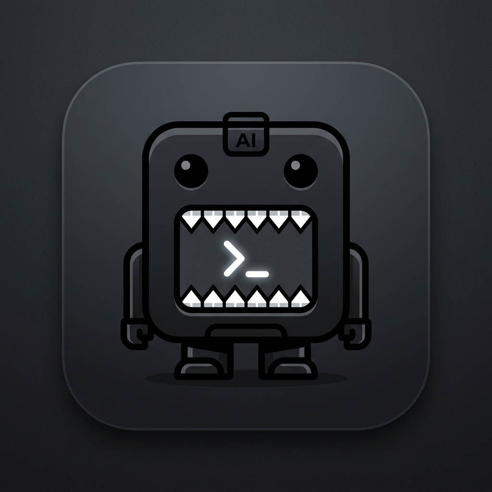
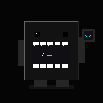

# DomoSkills — The Open Agent Skills Marketplace

```text
DOMOSKILLS_
Open skills. Smarter agents. Your stack.
```

<div align="center">
  
  <br />
  
  <p><strong>The free, open-source capability registry and CLI package manager for AI Agent Skills.</strong></p>
</div>

DomoSkills is a developer-native discovery engine and CLI installer for **AI Agent Skills**. Discover modular capabilities, curate your project's skill stack, and install directly into your AI coding assistant workspace in a single command.

---

## Quick Start

### 1. Discover Skills
Explore the open web registry at `http://localhost:3000/explore` or search from your terminal:

```bash
npx domoskills search react
npx domoskills search security
```

### 2. Add Skills to Your Project
Install single or multiple skills:

```bash
# Universal standard (default)
npx domoskills add react-performance owasp-agent-guardian

# Target a specific AI coding agent
npx domoskills add nextjs-app-router --agent claude
npx domoskills add fastapi-clean-architecture --agent cursor
npx domoskills add rag-pipeline-architect --agent opencode
```

### 3. Initialize & Diagnose Workspace
```bash
npx domoskills init
npx domoskills doctor
npx domoskills audit
npx domoskills list
```

---

## Architecture

DomoSkills is organized as a high-performance Turborepo monorepo:

```text
domoskills/
├── apps/
│   └── web/                   # Next.js 14 App Router web platform
├── packages/
│   ├── cli/                   # Executable `domoskills` CLI installer
│   ├── registry/              # Search engine, seed database, and ingestion providers
│   ├── skill-parser/          # SKILL.md YAML frontmatter parser & AST security scanner
│   ├── validators/            # Zod schemas for skills, manifests, and submissions
│   └── adapters/              # Multi-agent directory mappings and command generators
├── package.json
├── turbo.json
└── README.md
```

---

## Supported Agent Target Ecosystems

DomoSkills provides an adapter layer supporting all modern AI coding agents:

| Agent Target | Flag | Installation Path | Configuration Marker |
| :--- | :--- | :--- | :--- |
| **Universal Standard** | `--agent universal` | `.agent/skills/` | `.agent/agent.yaml` |
| **Claude Code** | `--agent claude` | `.claude/skills/` | `.claude/config.json` |
| **OpenAI Codex / Agents** | `--agent codex` | `.agents/skills/` | `.agents/manifest.json` |
| **Cursor IDE** | `--agent cursor` | `.cursor/skills/` | `.cursorrules` |
| **OpenCode Interpreter** | `--agent opencode` | `.opencode/skills/` | `.opencode/opencode.json` |
| **GitHub Copilot** | `--agent copilot` | `.github/skills/` | `.github/copilot-instructions.md` |
| **Gemini CLI / Antigravity** | `--agent gemini` | `.gemini/skills/` | `.gemini/skills/` |

---

## Security Model

Installation means safely downloading and copying approved Markdown and reference files. DomoSkills protects your system by design:

1. **Zero Automatic Execution**: DomoSkills will NEVER execute arbitrary scripts or binaries downloaded from remote repositories.
2. **Path Traversal Guard**: Prevents `../` directory escapes and forbids absolute path injection.
3. **Quarantine & Auditing**: Compiled binaries and script files (`.sh`, `.py`, `.bat`) are quarantined in read-only mode and clearly flagged with warning badges in the UI and CLI audit logs.
4. **Secret & Pattern Scanning**: Ast-level pattern scanning flags hardcoded credentials, malicious shell pipes (`curl | bash`), and destructive commands.

---

## `domoskills.json` Lockfile

When installing skills, DomoSkills creates a reproducible lockfile:

```json
{
  "version": 1,
  "agent": "universal",
  "skills": [
    {
      "name": "react-performance",
      "source": "domoskills/official-agent-skills",
      "version": "1.4.2",
      "commit": "7f9a12c",
      "installedAt": "2026-08-30T12:00:00.000Z"
    }
  ]
}
```

Reproduce an entire capability stack on any machine:
```bash
npx domoskills install
```

---

## Local Development

```bash
# Clone the repository
git clone https://github.com/domoskills/domoskills.git
cd domoskills

# Install dependencies
pnpm install

# Build all packages & web application
pnpm build

# Run unit and integration tests
pnpm test

# Launch web dev server
pnpm dev
```

---

## License

Licensed under the [MIT License](LICENSE).
Curated skills preserve their original open-source repository licenses (MIT, Apache-2.0, BSD).
